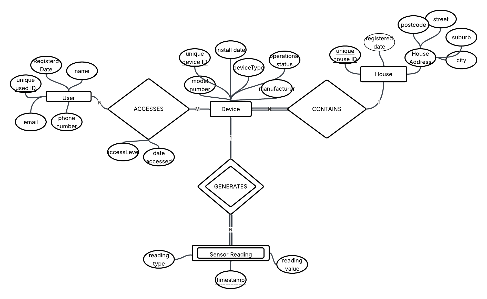
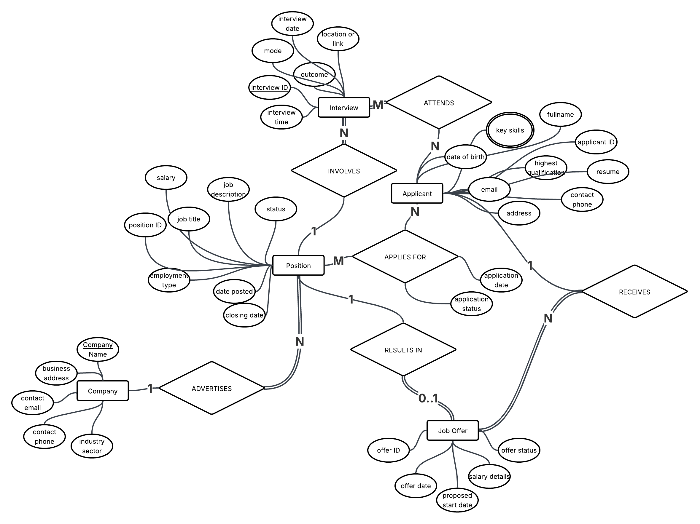
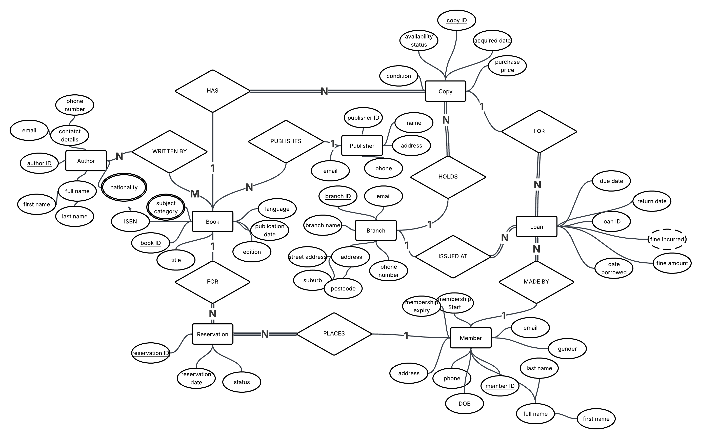
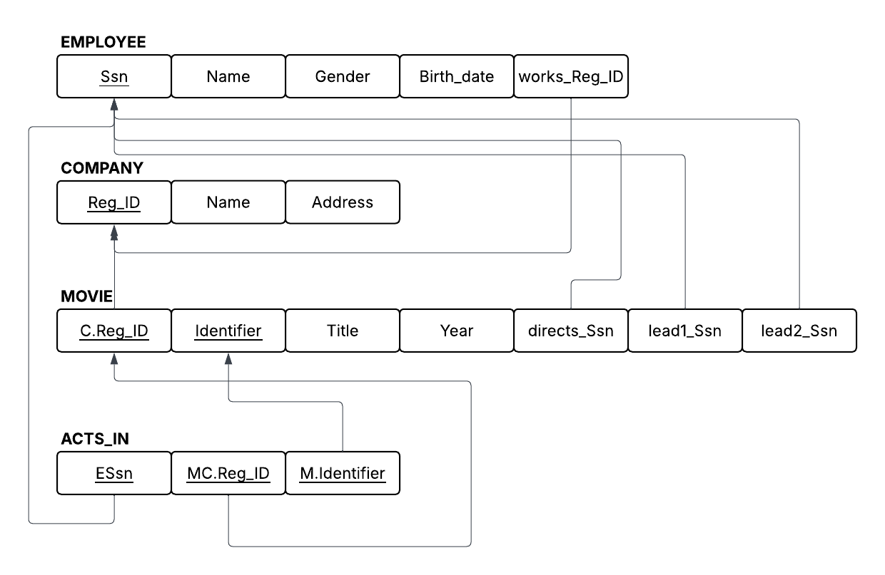
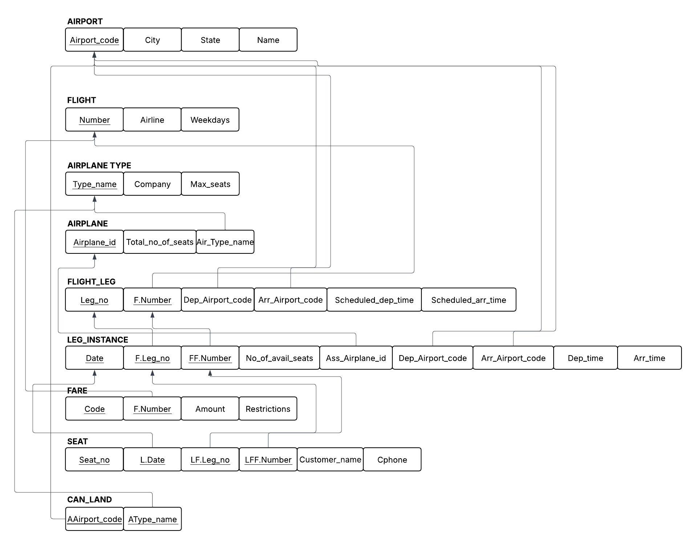

# Database Design & ER Modelling Portfolio 

## Overview 
This repository showcases my work in conceptual and logical database design, completed as part of COMPSCI 351 at the University of Auckland. It demonstrates my ability to analyse system recquirements, design Entity-Relationship (ER) models, and map them to relational database schemas 

---

## Skills Demonstrated 
- Entitity-Relationship (ER) modelling using standard ER notation
- Identifying entities, attributes, relationships and constraints from natural language specfications
- Modelling complex concepts including weak entities, composite attributes, multivalued attributes, derived attributes, and participation constraints
- Converting ER diagrams to relational schemas using the 7-step Er-to-relational mapping algorithm
- Identify primary keys, foreign keys and composite keys
- Handling special cases including weak entity chains, fixed cardinality relationships and self-referencing realtionships

---

## Projects 

### Smart Home IoT System 
Designed a conceptual ER model for a smart home platform managing houses, devices, users and sensore data 

**Key concepts applied**
- Weak entity (`Sensor Reading`) with identifying relationship
- Partial and total perticipation constraints
- M:N relationhsip with descriptive attributes (`ACCESSES`)
- Partial key notation for weak entity identification

---

### Recruitment Management System
Designed a conceptual ER model for a job agency managing companies, positions, applicants, interviews and job offers.

**Key concepts applied:**
- Multivalued attribute (`keySkills`) modelled with double oval
- M:N relationship with descriptive attributes (`APPLIES_FOR`)
- Fixed cardinality constraints on job offers
- Composite attributes for address and full name

---

### City Library Network
Designed a conceptual ER model for a city-wide library network managing branches, books, copies, members, loans and reservations.

**Key concepts applied:**
- Derived attribute (`fineIncurred`) modelled with dashed oval
- Composite attributes (`fullName`, `contactDetails`, `address`)
- Multivalued attributes (`nationality`, `subjectCategory`)
- Chain of binary relationships through `Reservation` entity rather than ternary relationship
- Surrogate key design decision for `Publisher`
- Reasoning for strong vs weak entity classification for `Copy` and `Publisher`

---

### MOVIES ER to Relational Mapping
Applied the 7-step ER-to-relational mapping algorithm to transform the MOVIES ER diagram into a full relational schema.

**Key concepts applied:**
- Mapping weak entity (`Movie`) with composite PK
- Handling fixed cardinality 2:N relationship (`lead_role`) using two FK columns
- M:N relationship mapping (`acts_in`)
- Self-referencing and multiple FK references to same relation

---

### AIRPORT ER to Relational Mapping
Applied the 7-step ER-to-relational mapping algorithm to transform the AIRPORT ER diagram into a full relational schema.

**Key concepts applied:**
- Chain of weak entities (`Flight_Leg` → `Leg_Instance` → `Seat`)
- Progressive composite PK inheritance across weak entity chain
- Multiple FK references to same relation (`Airport` referenced twice in `Flight_Leg` and `Leg_Instance`)
- M:N relationship mapping (`Can_Land`)
- Relationship attributes absorbed into correct relations

---

## ER Notation Guide
The diagrams in this repository use standard ER notation as follows:

| Symbol | Meaning |
|---|---|
| Rectangle | Strong entity |
| Double rectangle | Weak entity |
| Diamond | Relationship |
| Double diamond | Identifying relationship |
| Oval | Attribute |
| Dashed oval | Derived attribute |
| Double oval | Multivalued attribute |
| Solid underline | Primary key |
| Dashed underline | Partial key |
| Single line | Partial participation |
| Double line | Total participation |

---

## Tools Used
- Lucidchart — ER diagram design
- GitHub — version control and portfolio hosting

---

## Key Learnings
- The difference between total and partial participation and how this translates to NOT NULL constraints in the relational model
- Why weak entities require both existential dependency AND inability to be uniquely identified without their owner
- How composite PKs grow progressively longer through chains of weak entities
- The importance of stating assumptions explicitly when requirements are ambiguous
- How derived attributes eliminate redundancy in data models
Just paste this directly into your README.md file and the diagrams will render automatically once you upload the PNG files into the correct folders. Good luck!Sonnet 4.6
